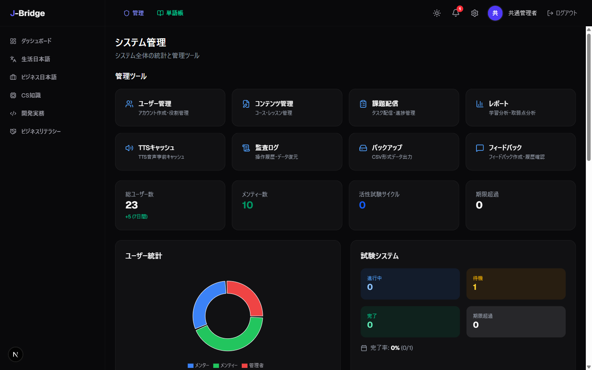
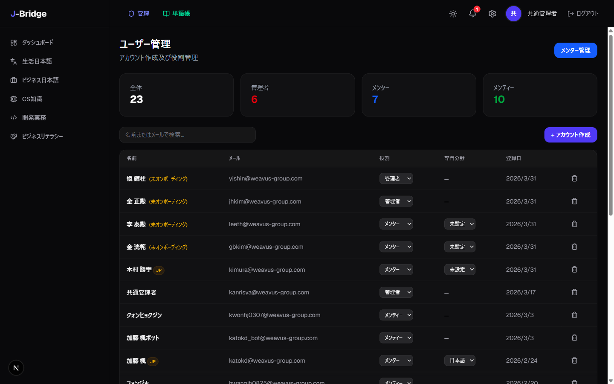
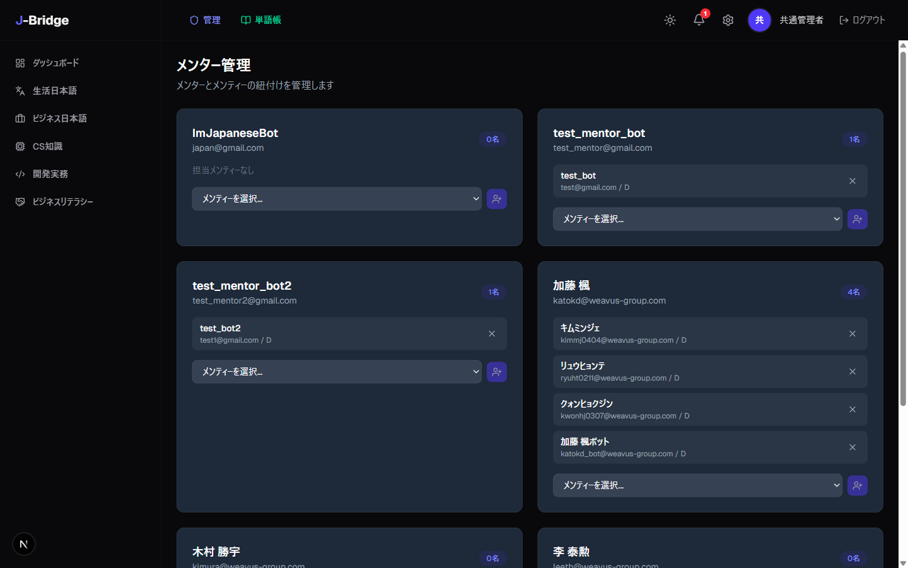
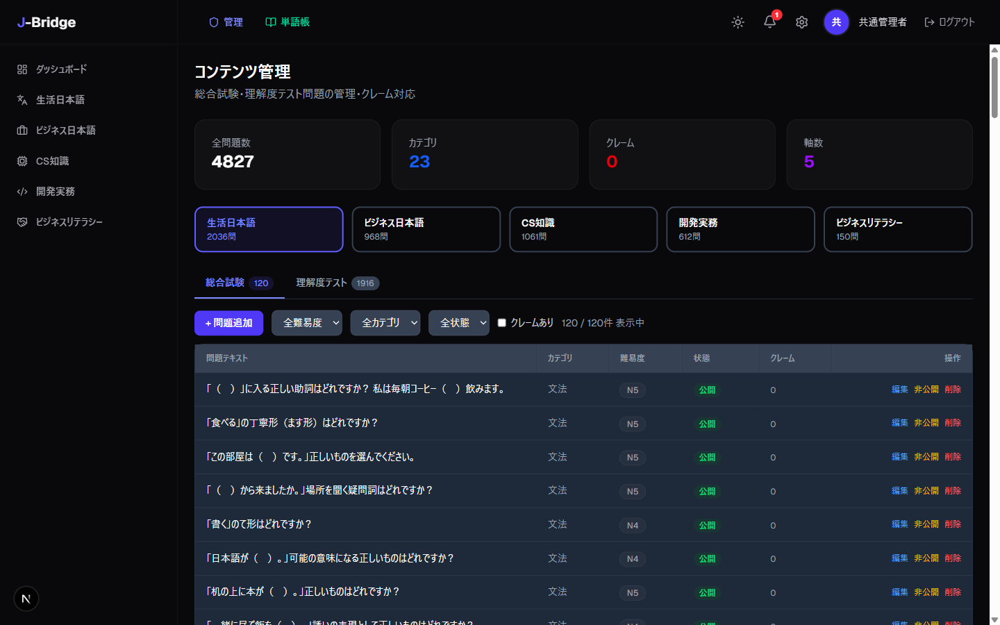
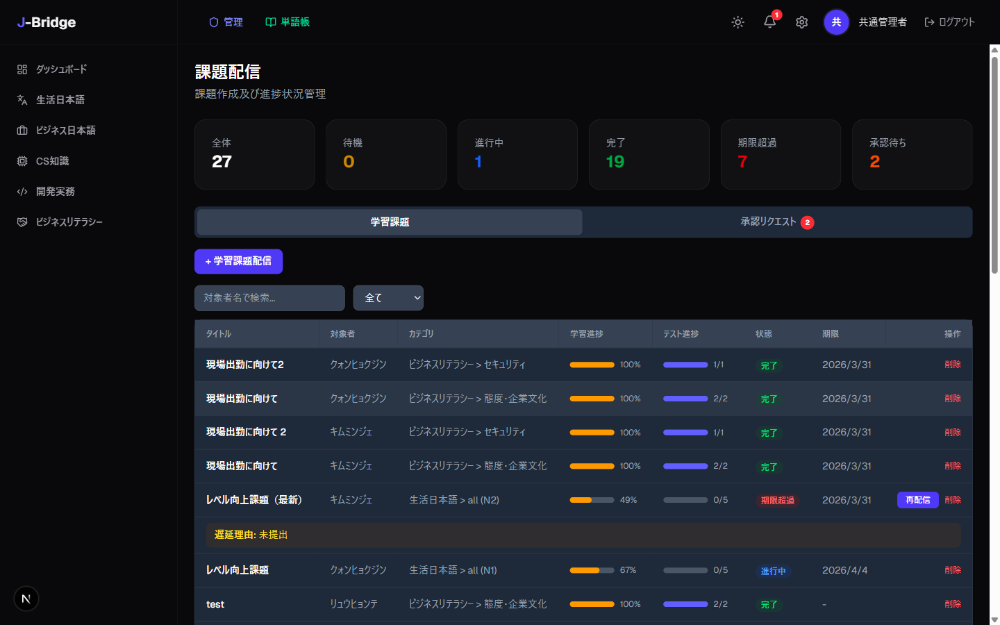
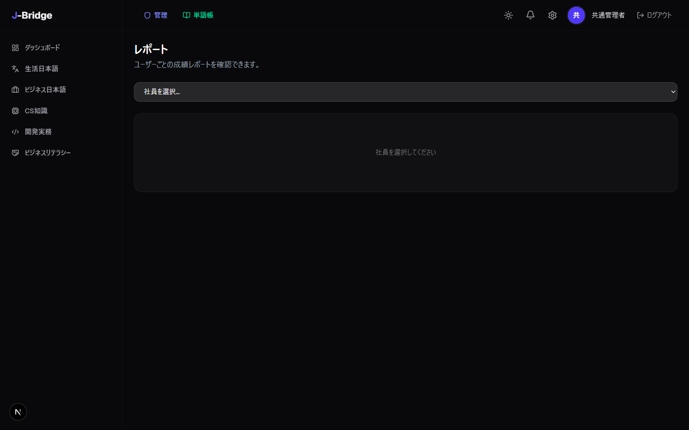
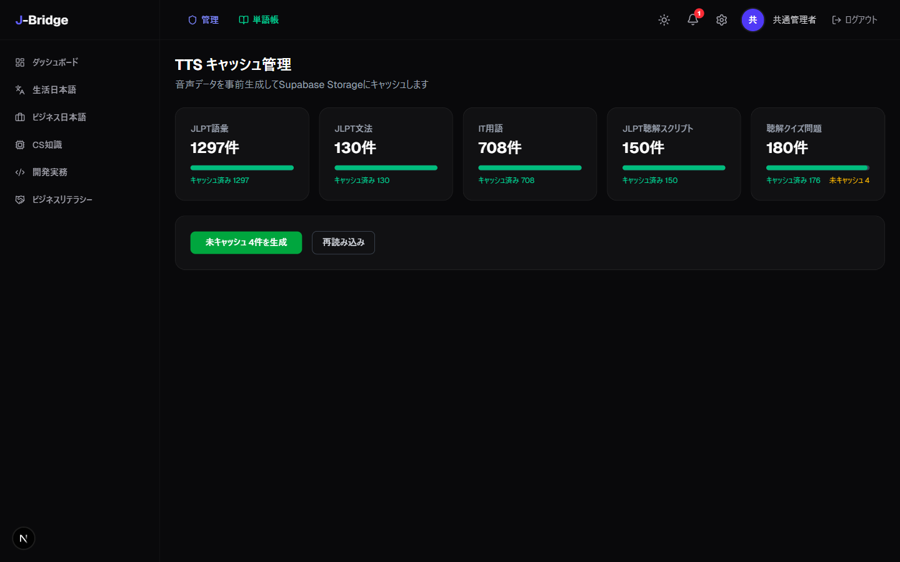
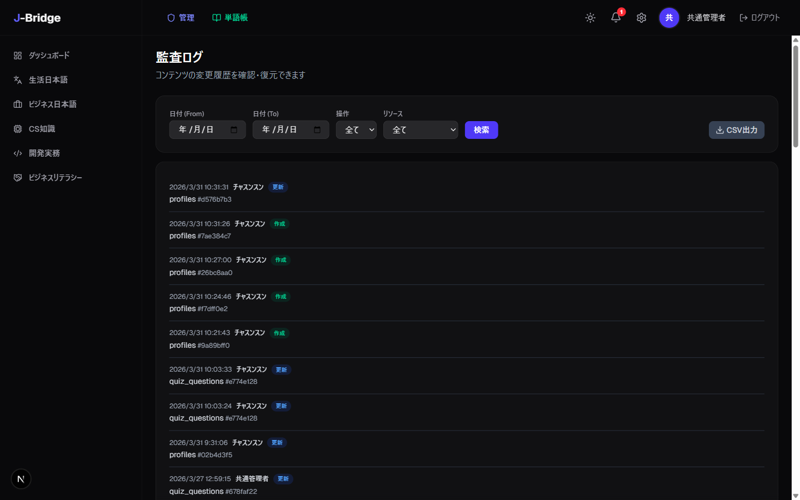
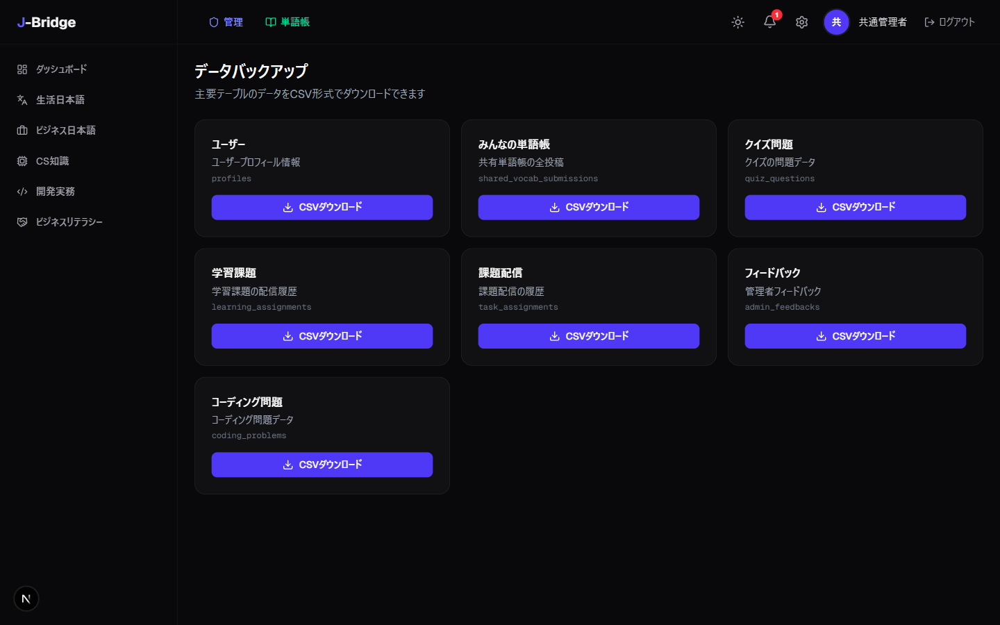

# J-Bridge 管理者マニュアル

> 本マニュアルは J-Bridge LMS を使用する管理者向けのガイドです。
> 管理者はすべての学習・メンター機能に加え、システム管理機能を利用できます。

---

## 目次

1. [システムダッシュボード](#1-システムダッシュボード)
2. [アカウント作成・管理](#2-アカウント作成管理)
3. [メンター配置](#3-メンター配置)
4. [コンテンツ管理](#4-コンテンツ管理)
5. [課題配信](#5-課題配信)
6. [成績レポート](#6-成績レポート)
7. [TTSキャッシュ管理](#7-ttsキャッシュ管理)
8. [監査ログ](#8-監査ログ)
9. [バックアップ](#9-バックアップ)

> **学習・メンター機能について:** 管理者はすべての学習コンテンツ、試験、メンター機能を利用できます。
> 学習機能は[メンティーマニュアル](mentee-manual-ja.md)、メンター機能は[メンターマニュアル](mentor-manual-ja.md)をご参照ください。

---

## 1. システムダッシュボード

**ページ:** `/admin`



管理ダッシュボードでシステム全体の状況を一目で確認できます：

| エリア | 説明 |
|--------|------|
| **スタットカード** | 総ユーザー数、活性試験サイクル、未読通知 |
| **ユーザー統計** | ロール別（admin/mentor/mentee）ユーザー分布チャート |
| **週間アクティビティ** | 直近4週間のクイズ・コード提出推移チャート |
| **コンテンツ概要** | コース、クイズ問題、用語集項目数 |
| **メンター負荷** | メンター別担当メンティー数チャート |
| **最近の監査ログ** | 直近のシステム変更履歴10件 |

1. 管理ダッシュボードで「ダッシュボード」をクリックします
2. 各エリアの数値とチャートを確認します

---

## 2. アカウント作成・管理

**ページ:** `/admin/users`



### 新規アカウント作成

1. 管理ダッシュボードで「ユーザー管理」をクリックします
2. 「新規作成」ボタンをクリックします
3. メールアドレス、氏名、ロール（admin/mentor/mentee）を入力します
4. 「作成」をクリックします
5. 作成されたアカウント情報を該当社員に伝達します

### ロール変更

1. ユーザー一覧から対象ユーザーを探します
2. ロールドロップダウンで変更するロールを選択します
3. 変更は即座に反映されます

---

## 3. メンター配置

**ページ:** `/admin/mentors`



### メンター専門分野設定

1. 管理ダッシュボードで「メンター一覧」をクリックします
2. メンターの専門分野を設定します：
   - **日本語メンター (jp)** — 日本語コンテンツ管理権限
   - **技術メンター (tech)** — 技術コンテンツ（クイズ、コース）管理権限
   - **未設定 (null)** — 両方アクセス可能

### メンター・メンティーマッチング

1. メンターを選択します
2. 担当するメンティーを指定します
3. 「保存」をクリックします

---

## 4. コンテンツ管理

**ページ:** `/admin/courses`



### 画面構成

1. **Step選択** — 5軸（生活日本語/ビジネス日本語/CS知識/開発実務/ビジネスリテラシー）から選択
2. **セクション選択** — 「総合試験」または「理解度テスト」
3. **フィルター** — 難易度、カテゴリ、公開状態、クレーム有無
4. **問題一覧** — 問題テキスト、カテゴリ、難易度、公開状態、クレーム数

### 問題追加

1. 「+ 問題追加」ボタンをクリックします
2. 問題テキストを入力します
3. 難易度とカテゴリを選択します
4. 選択肢4つを入力し、正解をラジオボタンで選択します
5. （任意）解説を入力します
6. 「保存」をクリックします

### 問題修正

1. 問題行の「編集」ボタンをクリックします
2. 内容を修正します
3. 「保存」をクリックします

> **注意:** 進行中の総合試験に含まれる問題は修正・削除できません。
> 試験完了後に修正してください。

### 問題公開/非公開

1. 問題行の公開状態トグルをクリックします
2. 非公開の問題はクイズと試験に出題されません

### クレーム処理

メンティーが問題のエラーを報告するとクレームとして受理されます。

1. 赤いクレームバッジがある問題をクリックします
2. クレーム内容（理由、報告者、日時）を確認します
3. 問題を修正するとクレームが**自動解決**されます
4. 修正せずに解決するには「全件解決」をクリックします
5. 複数問題のクレームを一括解決するにはツールバーの「クレーム一括解決」ボタンを使用します

---

## 5. 課題配信

**ページ:** `/admin/tasks`



### 学習課題作成

1. 管理ダッシュボードで「タスク管理」をクリックします
2. 「新規課題」ボタンをクリックします
3. 対象メンティー、課題内容、期限を入力します
4. 「作成」をクリックします

### 再試験リクエスト処理

1. 「再試験リクエスト」タブを選択します
2. リクエスト一覧でメンティーと試験カテゴリを確認します
3. 「承認」または「却下」をクリックします

### 課題ステータス管理

課題のステータスフロー：

```
未着手 (pending) → 進行中 (in_progress) → 完了 (completed)
                                        → 期限切れ (overdue)
```

---

## 6. 成績レポート

**ページ:** `/admin/reports`



1. 管理ダッシュボードで「レポート」をクリックします
2. 閲覧する社員を選択します（管理者は全社員閲覧可能）
3. **試験サイクル別スコア推移**グラフを確認します
4. **カテゴリ別誤答率**チャートを確認します：
   - 赤（50%以上） — 即時補強が必要
   - 黄（30〜50%） — 注意が必要
   - 緑（30%未満） — 良好

### AI指導方法プロンプト

5. 下部の「AIプロンプトをコピー」ボタンをクリックします
6. 該当社員の成績データがAI分析用プロンプトとしてクリップボードにコピーされます
7. ChatGPT等のAIチャットに貼り付けると弱点分析と指導方法の提案を受けられます

---

## 7. TTSキャッシュ管理

**ページ:** `/admin/tts-cache`



聴解問題で使用されるTTS音声キャッシュを管理します。

1. 管理ダッシュボードで「TTS管理」をクリックします
2. キャッシュ状態（生成数、容量）を確認します
3. 「一括生成」で事前に音声キャッシュを生成できます

> **参考:** TTSキャッシュを事前生成するとメンティーが聴解問題を解く際の待ち時間が短縮されます。

---

## 8. 監査ログ

**ページ:** `/admin/audit-log`



システムで発生したすべての変更操作を追跡できます。

1. 管理ダッシュボードで「監査ログ」をクリックします
2. リソースタイプ別フィルターで目的の項目を検索します：
   - `quiz_questions` — クイズ問題の変更
   - `profiles` — ユーザー情報の変更
   - `task_assignments` — 課題配信
   - `admin_feedbacks` — フィードバック作成
   - `quiz_attempts` — 再試験処理
   - `learning_assignments` — 学習課題
3. 各ログで変更者、変更日時、変更内容（before/after）を確認します

---

## 9. バックアップ

**ページ:** `/admin/backup`



7つの主要テーブルのデータをCSVでバックアップできます。

| テーブル | 内容 |
|----------|------|
| profiles | ユーザープロフィール |
| shared_vocab | 共有単語帳 |
| quiz_questions | クイズ問題 |
| learning_assignments | 学習課題 |
| task_assignments | 課題配信 |
| admin_feedbacks | 管理者フィードバック |

1. 管理ダッシュボードで「バックアップ」をクリックします
2. バックアップするテーブルを選択します
3. 「ダウンロード」をクリックするとCSVファイルがダウンロードされます
