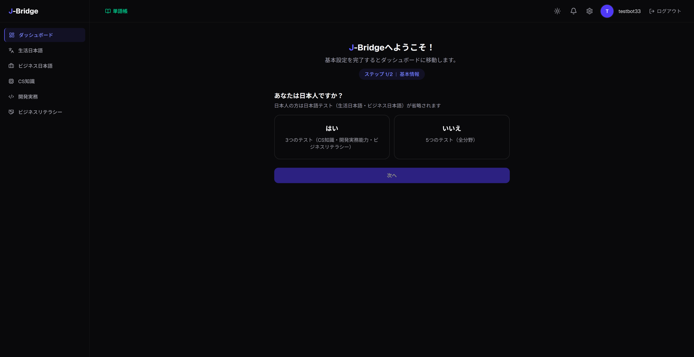
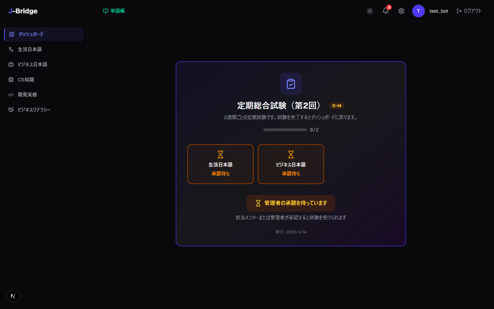
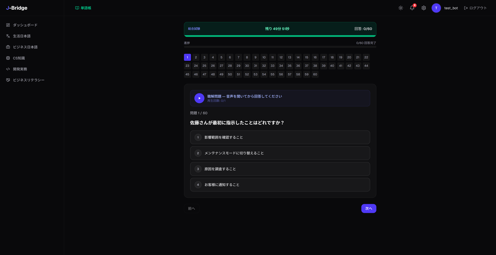

# J-Bridge メンティーマニュアル

> 本マニュアルは J-Bridge LMS を使用するメンティー（学習者）向けのガイドです。
> 各セクションに画面キャプチャと操作手順を含みます。

---

## 目次

1. [ログイン](#1-ログイン)
2. [オンボーディング（初期設定）](#2-オンボーディング初期設定)
3. [ダッシュボード](#3-ダッシュボード)
4. [総合試験ゲート](#4-総合試験ゲート)
5. [総合試験受験](#5-総合試験受験)
6. [生活日本語学習](#6-生活日本語学習)
7. [生活日本語理解度テスト](#7-生活日本語理解度テスト)
8. [ビジネス日本語学習](#8-ビジネス日本語学習)
9. [ビジネス日本語理解度テスト](#9-ビジネス日本語理解度テスト)
10. [共有単語帳](#10-共有単語帳)
11. [CS知識学習](#11-cs知識学習)
12. [CS知識理解度テスト](#12-cs知識理解度テスト)
13. [開発実務学習](#13-開発実務学習)
14. [Java資格証コース](#14-java資格証コース)
15. [開発実務理解度テスト](#15-開発実務理解度テスト)
16. [ビジネスリテラシー](#16-ビジネスリテラシー)
17. [ランキング](#17-ランキング)
18. [プロフィール / フィードバック](#18-プロフィール--フィードバック)
19. [学習課題](#19-学習課題)
20. [試験履歴](#20-試験履歴)
21. [個人単語帳](#21-個人単語帳)

---

## 1. ログイン

**ページ:** `/login`

1. 管理者から伝達された**メールアドレス**と**パスワード**を入力します
2. 「ログイン」ボタンをクリックします
3. 初回ログイン時はオンボーディング画面に遷移します

> **参考:** アカウントは管理者が作成し伝達します。自己登録には対応していません。

---

## 2. オンボーディング（初期設定）

**ページ:** `/onboarding`

> *この画面は初回ログイン時のみ表示されます。*

1. **日本人かどうか**を選択します
   - 「はい」選択時 → 3科目の試験（CS知識、開発実務、ビジネスリテラシー）
   - 「いいえ」選択時 → 5科目の試験（上記3科目 + 生活日本語、ビジネス日本語）
2. **主要プログラミング言語**を選択します
3. 「次へ」をクリックして初期評価を開始します
4. 生活日本語とビジネス日本語の初期評価問題を解いて現在の実力を測定します
5. 完了後、結果画面で5軸レーダーチャートを確認します

---

## 3. ダッシュボード

**ページ:** `/dashboard`

ダッシュボードで確認できる情報：

| エリア | 説明 |
|--------|------|
| **レーダーチャート** | 5軸能力値（生活日本語、ビジネス日本語、CS知識、開発実務、ビジネスリテラシー） |
| **最近の試験結果** | 直近の総合試験結果（スコア、合否） |
| **ランキング** | 全体ランキング内の自分の順位 |
| **次回試験日** | 次回総合試験の予定日 |

---

## 4. 総合試験ゲート

**ページ:** `/dashboard`（試験サイクル活性化時）

> *この画面は試験サイクルが活性化された時のみ表示されます。*

試験サイクルが開始されるとダッシュボードが試験ゲート画面に切り替わります。

1. 受験すべき**試験一覧**がカテゴリ別に表示されます
2. 受験する試験の「試験を開始」ボタンをクリックします
3. すべてのカテゴリの試験を完了するとサイクルが終了しダッシュボードに戻ります

> **参考:** 試験進行中はダッシュボードの代わりにこの画面のみ表示されます。

---

## 5. 総合試験受験

**ページ:** `/exam/[examId]`

> *この画面は試験受験中のみ表示されます。*

1. 画面上部の**タイマー**で残り時間を確認します
2. 各問題の選択肢から一つを選びます
3. 聴解問題の場合：
   - 再生ボタンを押して音声を聴きます（1回再生）
4. すべての問題を解いたら「提出」ボタンをクリックします
5. 時間超過時は自動で提出されます
6. 提出後、スコアと合格/不合格の結果が表示されます

---

## 6. 生活日本語学習

**ページ:** `/japanese/jlpt`

生活日本語（JLPT）メインページで5つのカテゴリを学習できます：

| カテゴリ | ページ | 内容 |
|----------|--------|------|
| **語彙** | `/japanese/jlpt/vocabulary` | N5〜N1レベル別単語一覧、例文 |
| **文法** | `/japanese/jlpt/grammar` | 文法パターン、例文、解説 |
| **読解** | `/japanese/jlpt/reading` | 読解文章、解釈練習 |
| **聴解** | `/japanese/jlpt/listening` | 聴解スクリプト、TTS音声再生 |
| **漢字** | `/japanese/jlpt/kanji` | 漢字の読み書き学習 |

1. 希望のカテゴリをクリックします
2. レベル（N5〜N1）を選択して学習コンテンツを確認します
3. 聴解項目では再生ボタンで音声を聴くことができます

---

## 7. 生活日本語理解度テスト

**ページ:** `/japanese/jlpt/quiz`

1. カテゴリ（語彙/文法/読解/聴解）とレベル（N5〜N1）別のクイズが表示されます
2. 受験するクイズを選択します
3. 各問題の選択肢を選びます
4. 「提出」ボタンで提出します
5. 結果画面で正解/不正解と解説を確認します

---

## 8. ビジネス日本語学習

**ページ:** `/japanese/business`

ビジネス日本語メインページで4つのカテゴリを学習できます：

| カテゴリ | ページ | 内容 |
|----------|--------|------|
| **用語集** | `/japanese/business/glossary` | ITビジネス用語、カテゴリ別分類 |
| **文型** | `/japanese/business/sentence-patterns` | ビジネス文型パターン |
| **表現** | `/japanese/business/expressions` | 実務表現 |
| **敬語** | `/japanese/business/keigo` | 尊敬語、謙譲語など |

1. 希望のカテゴリをクリックします
2. 学習コンテンツを読み例文を確認します

---

## 9. ビジネス日本語理解度テスト

**ページ:** `/japanese/business/quiz/tests?type=...`

各学習ページ（用語集/文型/表現/敬語）で80%以上学習を完了すると「理解度テスト」ボタンが有効化されます。

1. 学習ページ下部の「理解度テスト」ボタンをクリックします
2. 該当カテゴリのフルクイズが表示されます（ランダム出題、難易度別配分）
3. 問題を解いて提出します
4. 結果を確認します

> **参考:** `/japanese/business/quiz`に直接アクセスするとビジネス日本語メインページに遷移します。

---

## 10. CS知識学習

**ページ:** `/cs`

8つのカテゴリで構成されたCS知識学習：

| カテゴリ | 内容 |
|----------|------|
| 情報基礎理論 | 数値表現、論理演算 |
| アルゴリズム | ソート、探索、時間計算量 |
| データ構造 | 配列、スタック、キュー、ツリー |
| コンピュータ構成 | CPU、メモリ、入出力 |
| OS | プロセス、メモリ管理 |
| データベース | SQL、正規化、トランザクション |
| ネットワーク | TCP/IP、HTTP、DNS |
| セキュリティ | 暗号化、認証、脆弱性 |

1. カテゴリを選択します
2. レッスン一覧から学習するレッスンをクリックします
3. レッスンコンテンツを読んで学習します
4. レッスン完了時に進捗率が自動更新されます

---

## 12. CS知識理解度テスト

**ページ:** `/cs/quiz`

1. カテゴリ別のクイズが表示されます
2. 受験するクイズを選択します
3. 問題を解いて提出します
4. 結果を確認します

---

## 13. 開発実務学習

**ページ:** `/dev`

オンボーディング時に選択した言語を含む8つのカテゴリで構成：

| カテゴリ | 内容 |
|----------|------|
| CWF（共通基礎） | 開発共通基礎知識 |
| Java | Java基礎〜応用 |
| JavaScript | JS基礎〜応用 |
| Python | Python基礎〜応用 |
| SQL | データベース実務 |
| Spring Boot | Javaバックエンドフレームワーク |
| React | フロントエンドフレームワーク |
| Next.js | フルスタックフレームワーク |

1. カテゴリを選択します
2. レッスン一覧から学習するレッスンをクリックします
3. レッスンコンテンツを読んで学習します
4. プログレスバーで現在の進捗率を確認します

---

## 14. Java資格証コース

**ページ:** `/dev/java?tab=cert`

> Javaカテゴリでのみ「資格証」タブが提供されます。

1. `/dev/java` ページで「資格証」タブをクリックします
2. 3段階のコースが表示されます：
   - **ブロンズ** — 基礎
   - **シルバー** — 中級（ブロンズ完了で解禁）
   - **ゴールド** — 上級（シルバー完了で解禁）
3. 解禁されたコースのレッスンをクリックして学習します

---

## 15. 開発実務理解度テスト

**ページ:** `/dev/quiz`

1. カテゴリ別のクイズが表示されます
2. 受験するクイズを選択します
3. 問題を解いて提出します
4. 結果を確認します

---

## 16. ビジネスリテラシー

**ページ:** `/business-literacy`

2つのカテゴリで構成：

| カテゴリ | ページ | 内容 |
|----------|--------|------|
| **態度・文化** | `/business-literacy/attitude-culture` | 職場マナー、文化理解 |
| **セキュリティ** | `/business-literacy/security` | 情報セキュリティ基礎 |

1. カテゴリを選択します
2. 学習コンテンツを読みます
3. 各カテゴリの「理解度テスト」でクイズを受験します

---

## 17. ランキング

**ページ:** `/ranking`

1. 現在のシーズンの全体ランキングが表示されます
2. カテゴリ別フィルターで目的のエリアのランキングを確認します
3. 自分の順位とスコアを確認します

---

## 18. プロフィール / フィードバック

**ページ:** `/profile`, `/profile/feedback`

1. プロフィールページで自分の情報を確認します

2. 「フィードバック」タブで管理者/メンターからのフィードバックを確認します

---

## 19. 学習課題

**ページ:** `/dashboard/assignments`

1. 管理者/メンターが配信した学習課題一覧が表示されます
2. 課題のステータスを確認します：
   - **未着手** — まだ開始していない課題
   - **進行中** — 進行中の課題
   - **完了** — 完了した課題
   - **期限切れ** — 期限が過ぎた課題
3. 課題をクリックして詳細を確認し進めます

---

## 20. 試験履歴

**ページ:** `/dashboard/history`

1. 過去の総合試験およびクイズの受験履歴が表示されます
2. 試験をクリックすると詳細レビュー画面に遷移します
3. 各問題の正解/不正解、自分の選択、解説を確認します

---

## 21. 個人単語帳

**ページ:** `/personal-vocab`

1. 「追加」ボタンで新しい単語を登録します
2. 単語/読み/意味を入力して保存します
3. 登録済み単語一覧を検索・管理します
