# J-Bridge 멘티 매뉴얼

> 본 매뉴얼은 J-Bridge LMS를 사용하는 멘티(학습자)를 위한 안내서입니다.
> 각 섹션마다 화면 캡처와 조작 순서를 포함합니다.

---

## 목차

1. [로그인](#1-로그인)
2. [온보딩 (초기 설정)](#2-온보딩-초기-설정)
3. [대시보드](#3-대시보드)
4. [종합시험 게이트](#4-종합시험-게이트)
5. [종합시험 응시](#5-종합시험-응시)
6. [생활일본어 학습](#6-생활일본어-학습)
7. [생활일본어 이해도테스트](#7-생활일본어-이해도테스트)
8. [비즈니스일본어 학습](#8-비즈니스일본어-학습)
9. [비즈니스일본어 이해도테스트](#9-비즈니스일본어-이해도테스트)
10. [공유단어장](#10-공유단어장)
11. [CS지식 학습](#11-cs지식-학습)
12. [CS지식 이해도테스트](#12-cs지식-이해도테스트)
13. [개발실무 학습](#13-개발실무-학습)
14. [Java 자격증 코스](#14-java-자격증-코스)
15. [개발실무 이해도테스트](#15-개발실무-이해도테스트)
16. [비즈니스리테라시](#16-비즈니스리테라시)
17. [랭킹](#17-랭킹)
18. [프로필 / 피드백](#18-프로필--피드백)
19. [학습과제](#19-학습과제)
20. [시험 이력](#20-시험-이력)
21. [개인단어장](#21-개인단어장)

---

## 1. 로그인

**페이지:** `/login`

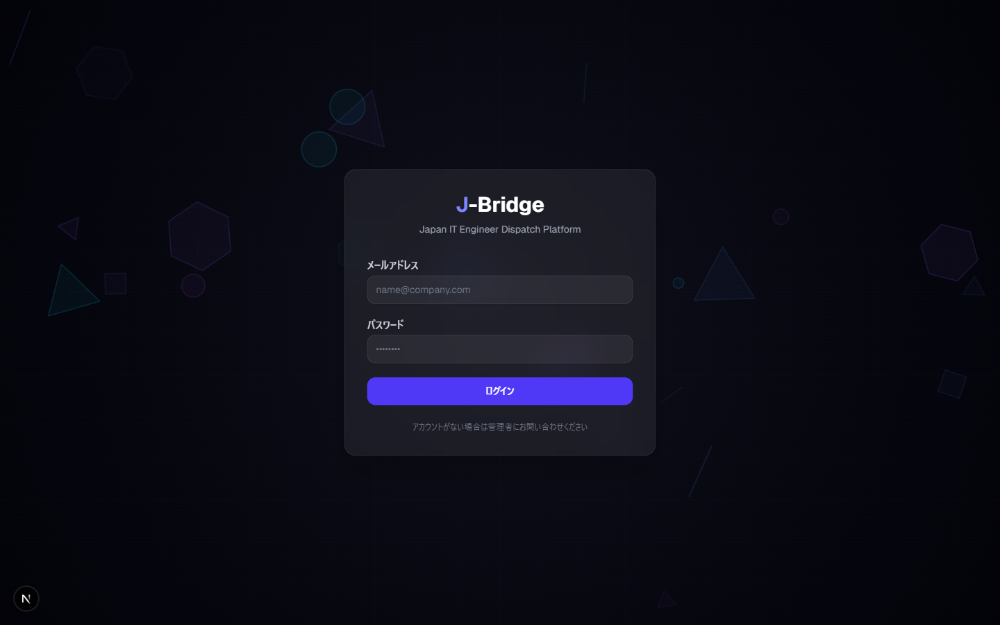

1. 관리자로부터 전달받은 **이메일**과 **비밀번호**를 입력합니다
2. 「ログイン」 버튼을 클릭합니다
3. 최초 로그인 시 온보딩 화면으로 이동합니다

> **참고:** 계정은 관리자가 생성하여 전달합니다. 자체 회원가입은 지원하지 않습니다.

---

## 2. 온보딩 (초기 설정)

**페이지:** `/onboarding`

> *이 화면은 최초 로그인 시에만 표시됩니다.*

1. **일본인 여부**를 선택합니다
   - 「はい」 선택 시 → 3개 시험 (CS지식, 개발실무, 비즈니스리테라시)
   - 「いいえ」 선택 시 → 5개 시험 (위 3개 + 생활일본어, 비즈니스일본어)
2. **주요 프로그래밍 언어**를 선택합니다
3. 「次へ」를 클릭하여 초기 평가를 시작합니다
4. 각 카테고리별 초기 평가 문제를 풀어 현재 실력을 측정합니다
5. 완료 후 결과 화면에서 5축 레이더 차트를 확인합니다

---

## 3. 대시보드

**페이지:** `/dashboard`

대시보드에서 확인할 수 있는 정보:

| 영역 | 설명 |
|------|------|
| **레이더 차트** | 5축 능력치 (生活日本語, ビジネス日本語, CS知識, 開発実務, ビジネスリテラシー) |
| **最近の試験結果** | 최근 종합시험 결과 (점수, 합격 여부) |
| **ランキング** | 전체 랭킹 내 본인 순위 |
| **次回試験日** | 다음 종합시험 예정일 |

---

## 4. 종합시험 게이트

**페이지:** `/dashboard` (시험 사이클 활성화 시)

> *이 화면은 시험 사이클이 활성화되었을 때만 표시됩니다.*

시험 사이클이 시작되면 대시보드가 시험 게이트 화면으로 전환됩니다.

1. 응시해야 할 **시험 목록**이 카테고리별로 표시됩니다
2. 응시할 시험의 「試験を開始」 버튼을 클릭합니다
3. 모든 카테고리의 시험을 완료하면 사이클이 종료되고 대시보드로 복귀합니다

> **참고:** 시험 진행 중에는 대시보드 대신 이 화면만 표시됩니다.

---

## 5. 종합시험 응시

**페이지:** `/exam/[examId]`

> *이 화면은 시험 응시 중에만 표시됩니다.*

1. 화면 상단의 **타이머**에서 남은 시간을 확인합니다
2. 각 문제의 보기 중 하나를 선택합니다
3. 청해(聴解) 문제의 경우:
   - 재생 버튼을 눌러 음성을 듣습니다 (1회 재생)
   - 속도 조절 가능 (0.75x / 1.0x / 1.25x)
4. 모든 문제를 풀었으면 「提出」 버튼을 클릭합니다
5. 시간 초과 시 자동으로 제출됩니다
6. 제출 후 점수와 합격/불합격 결과가 표시됩니다

---

## 6. 생활일본어 학습

**페이지:** `/japanese/jlpt`

생활일본어(JLPT) 메인 페이지에서 5개 카테고리를 학습할 수 있습니다:

| 카테고리 | 페이지 | 내용 |
|----------|--------|------|
| **語彙 (어휘)** | `/japanese/jlpt/vocabulary` | N5~N1 레벨별 단어 목록, 예문 |
| **文法 (문법)** | `/japanese/jlpt/grammar` | 문법 패턴, 예문, 해설 |
| **読解 (독해)** | `/japanese/jlpt/reading` | 독해 지문, 해석 연습 |
| **聴解 (청해)** | `/japanese/jlpt/listening` | 청해 스크립트, TTS 음성 재생 |
| **漢字 (한자)** | `/japanese/jlpt/kanji` | 한자 읽기/쓰기 학습 |

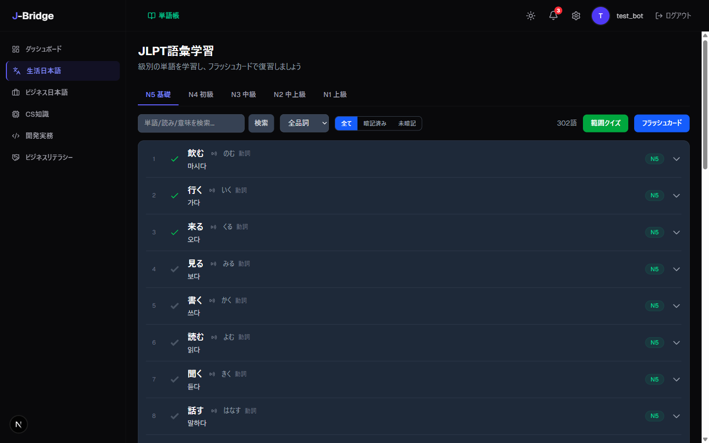

1. 원하는 카테고리를 클릭합니다
2. 레벨(N5~N1)을 선택하여 학습 콘텐츠를 확인합니다
3. 청해 항목에서는 재생 버튼으로 음성을 들을 수 있습니다

---

## 7. 생활일본어 이해도테스트

**페이지:** `/japanese/jlpt/quiz`

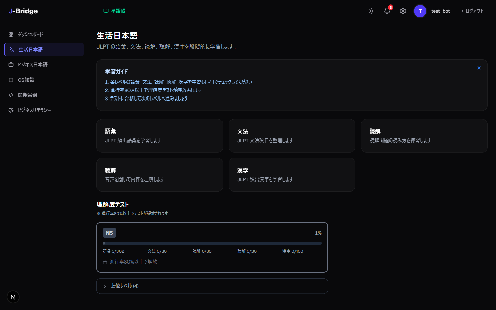

1. 카테고리(어휘/문법/독해/청해)와 레벨(N5~N1)별 퀴즈가 표시됩니다
2. 응시할 퀴즈를 선택합니다

3. 각 문제의 보기를 선택합니다
4. 「提出」 버튼으로 제출합니다
5. 결과 화면에서 정답/오답과 해설을 확인합니다

---

## 8. 비즈니스일본어 학습

**페이지:** `/japanese/business`

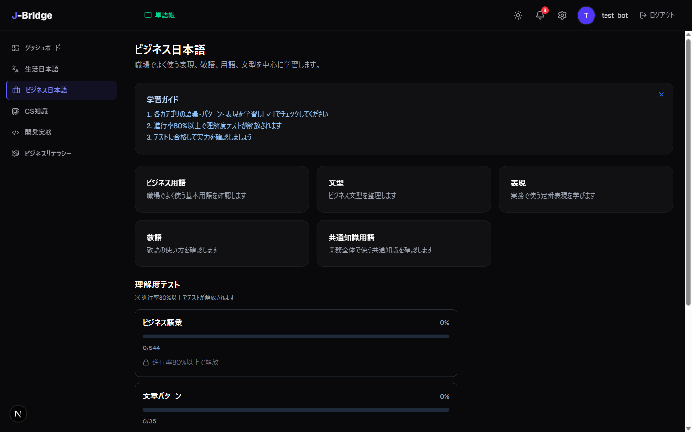

비즈니스일본어 메인 페이지에서 4개 카테고리를 학습할 수 있습니다:

| 카테고리 | 페이지 | 내용 |
|----------|--------|------|
| **用語集 (용어집)** | `/japanese/business/glossary` | IT 비즈니스 용어, 카테고리별 분류 |
| **文型 (문형)** | `/japanese/business/sentence-patterns` | 비즈니스 문형 패턴 |
| **表現 (표현)** | `/japanese/business/expressions` | 실무 표현 |
| **敬語 (경어)** | `/japanese/business/keigo` | 존경어, 겸양어 등 |

1. 원하는 카테고리를 클릭합니다
2. 학습 콘텐츠를 읽고 예문을 확인합니다

---

## 9. 비즈니스일본어 이해도테스트

**페이지:** `/japanese/business/quiz/tests?type=...`

각 학습 페이지(용어집/문형/표현/경어)에서 80% 이상 학습을 완료하면 「理解度テスト」 버튼이 활성화됩니다.

1. 학습 페이지 하단의 「理解度テスト」 버튼을 클릭합니다
2. 해당 카테고리의 풀 퀴즈가 표시됩니다 (랜덤 출제, 난이도별 배분)
3. 문제를 풀고 제출합니다
4. 결과를 확인합니다

> **참고:** `/japanese/business/quiz`에 직접 접근하면 비즈니스일본어 메인 페이지로 이동합니다.

---

## 10. 공유단어장

**페이지:** `/japanese/business/shared-vocab`

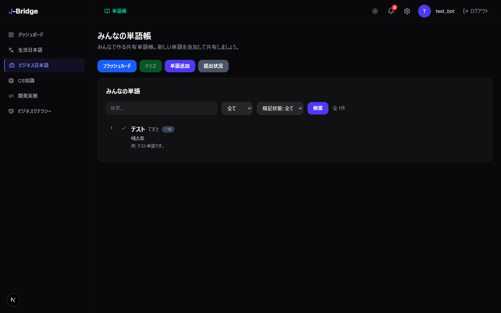

1. 다른 학습자들이 등록한 단어를 열람할 수 있습니다
2. 「追加」 버튼으로 새로운 단어를 등록합니다
3. 단어/읽기/의미를 입력하고 저장합니다

---

## 11. CS지식 학습

**페이지:** `/cs`

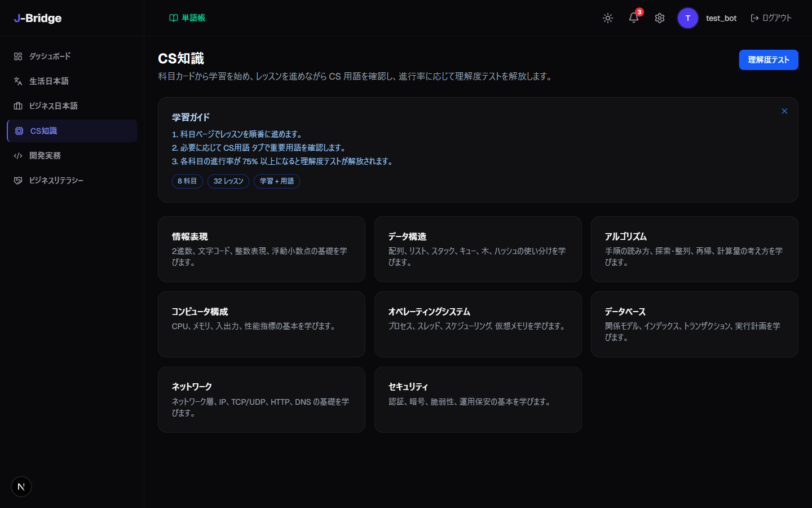

8개 카테고리로 구성된 CS지식 학습:

| 카테고리 | 내용 |
|----------|------|
| 情報基礎理論 (정보기초이론) | 수치표현, 논리연산 |
| アルゴリズム (알고리즘) | 정렬, 탐색, 시간복잡도 |
| データ構造 (자료구조) | 배열, 스택, 큐, 트리 |
| コンピュータ構成 (컴퓨터 구성) | CPU, 메모리, 입출력 |
| OS (운영체제) | 프로세스, 메모리 관리 |
| データベース (데이터베이스) | SQL, 정규화, 트랜잭션 |
| ネットワーク (네트워크) | TCP/IP, HTTP, DNS |
| セキュリティ (보안) | 암호화, 인증, 취약점 |

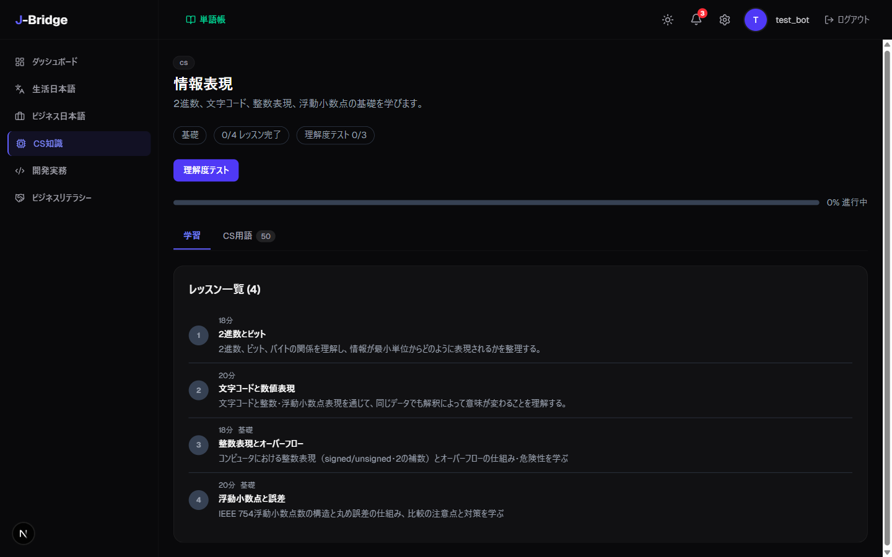

1. 카테고리를 선택합니다
2. 레슨 목록에서 학습할 레슨을 클릭합니다
3. 레슨 콘텐츠를 읽고 학습합니다
4. 레슨 완료 시 진행률이 자동 업데이트됩니다

---

## 12. CS지식 이해도테스트

**페이지:** `/cs/quiz`

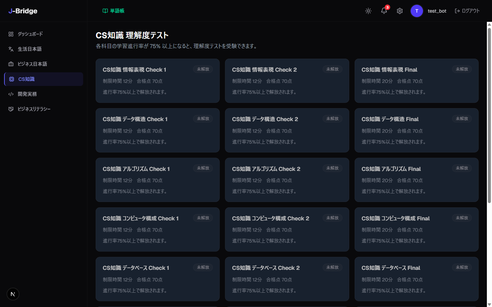

1. 카테고리별 퀴즈가 표시됩니다
2. 응시할 퀴즈를 선택합니다
3. 문제를 풀고 제출합니다
4. 결과를 확인합니다

---

## 13. 개발실무 학습

**페이지:** `/dev`

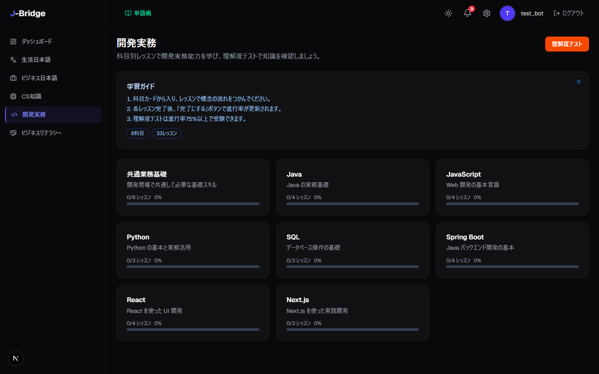

온보딩 시 선택한 언어를 포함, 8개 카테고리로 구성:

| 카테고리 | 내용 |
|----------|------|
| CWF (공통기초) | 개발 공통 기초 지식 |
| Java | Java 기초~응용 |
| JavaScript | JS 기초~응용 |
| Python | Python 기초~응용 |
| SQL | 데이터베이스 실무 |
| Spring Boot | Java 백엔드 프레임워크 |
| React | 프론트엔드 프레임워크 |
| Next.js | 풀스택 프레임워크 |

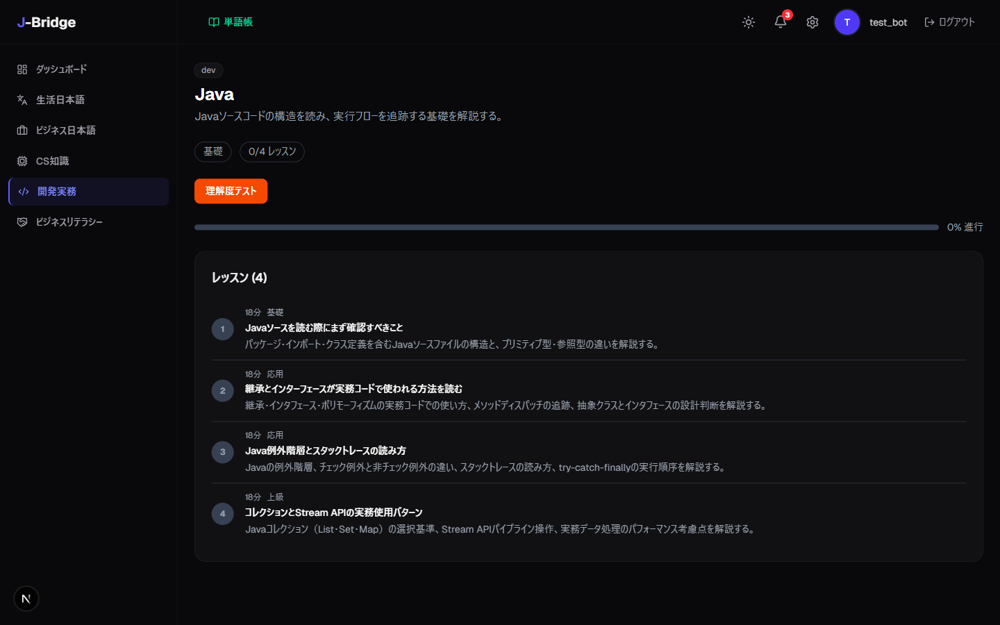

1. 카테고리를 선택합니다
2. 레슨 목록에서 학습할 레슨을 클릭합니다
3. 레슨 콘텐츠를 읽고 학습합니다
4. 진행바에서 현재 진행률을 확인합니다

---

## 14. Java 자격증 코스

**페이지:** `/dev/java?tab=cert`

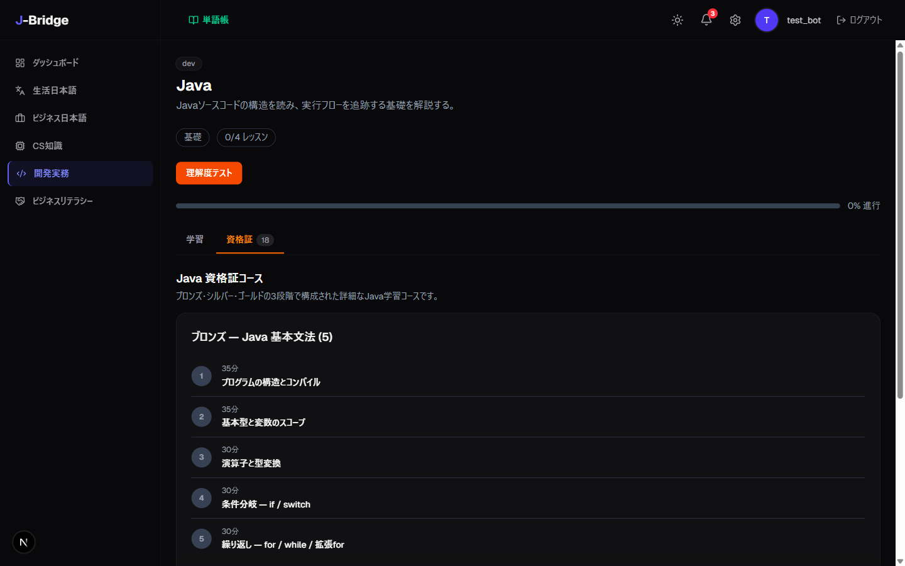

> Java 카테고리에서만 「資格証」 탭이 제공됩니다.

1. `/dev/java` 페이지에서 「資格証」 탭을 클릭합니다
2. 3단계 코스가 표시됩니다:
   - **ブロンズ (브론즈)** — 기초
   - **シルバー (실버)** — 중급 (브론즈 완료 시 해금)
   - **ゴールド (골드)** — 상급 (실버 완료 시 해금)
3. 해금된 코스의 레슨을 클릭하여 학습합니다

---

## 15. 개발실무 이해도테스트

**페이지:** `/dev/quiz`

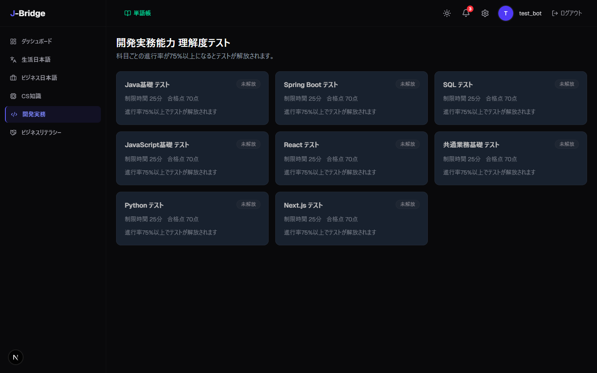

1. 카테고리별 퀴즈가 표시됩니다
2. 응시할 퀴즈를 선택합니다
3. 문제를 풀고 제출합니다
4. 결과를 확인합니다

---

## 16. 비즈니스리테라시

**페이지:** `/business-literacy`

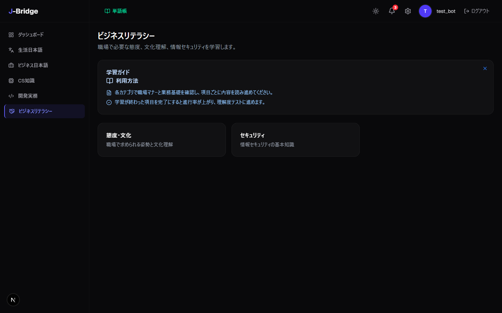

2개 카테고리로 구성:

| 카테고리 | 페이지 | 내용 |
|----------|--------|------|
| **態度・文化 (태도/문화)** | `/business-literacy/attitude-culture` | 직장 예절, 문화 이해 |
| **セキュリティ (보안)** | `/business-literacy/security` | 정보보안 기초 |

1. 카테고리를 선택합니다
2. 학습 콘텐츠를 읽습니다
3. 각 카테고리의 「理解度テスト」에서 퀴즈를 응시합니다

---

## 17. 랭킹

**페이지:** `/ranking`

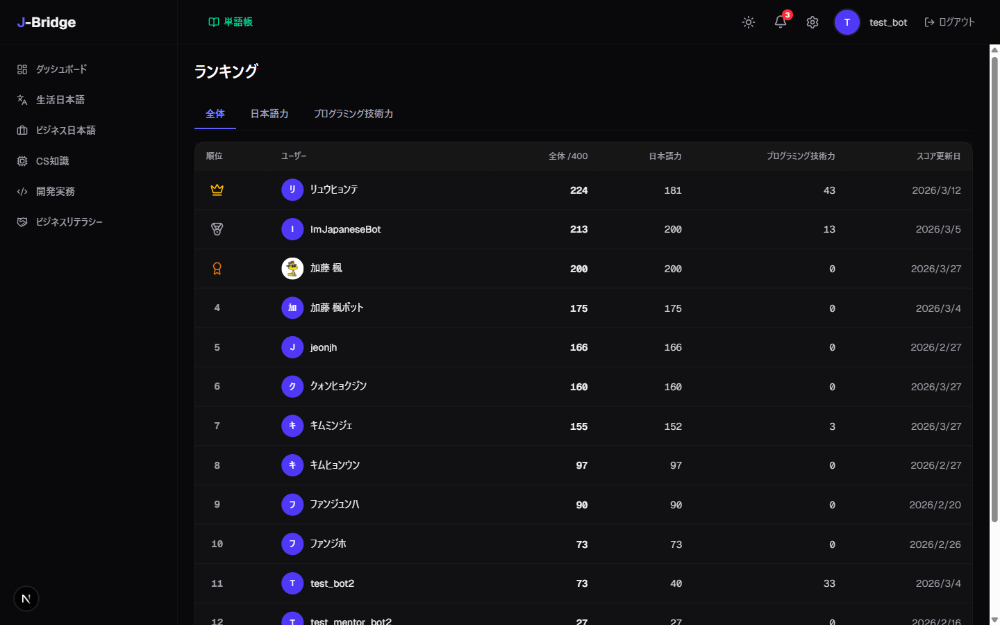

1. 현재 시즌의 전체 랭킹이 표시됩니다
2. 카테고리별 필터로 원하는 영역의 랭킹을 확인합니다
3. 본인의 순위와 점수를 확인합니다

---

## 18. 프로필 / 피드백

**페이지:** `/profile`, `/profile/feedback`

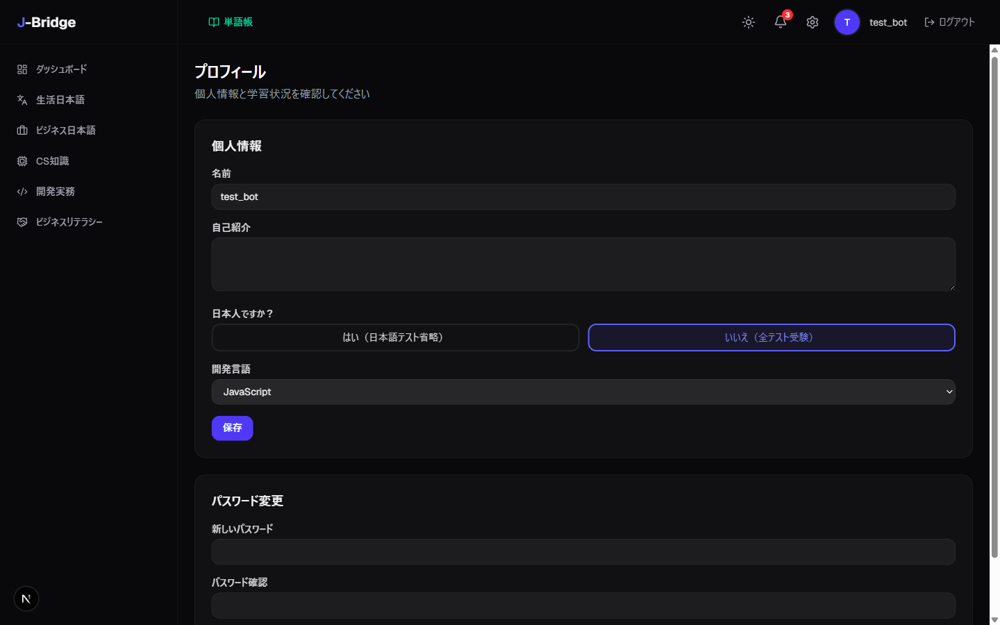

1. 프로필 페이지에서 본인 정보를 확인합니다

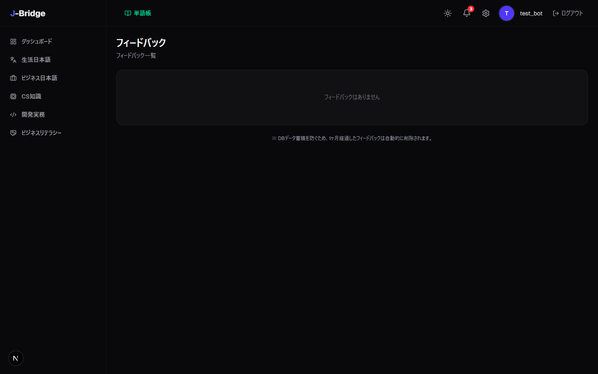

2. 「フィードバック」 탭에서 관리자/멘토로부터 받은 피드백을 확인합니다

---

## 19. 학습과제

**페이지:** `/dashboard/assignments`

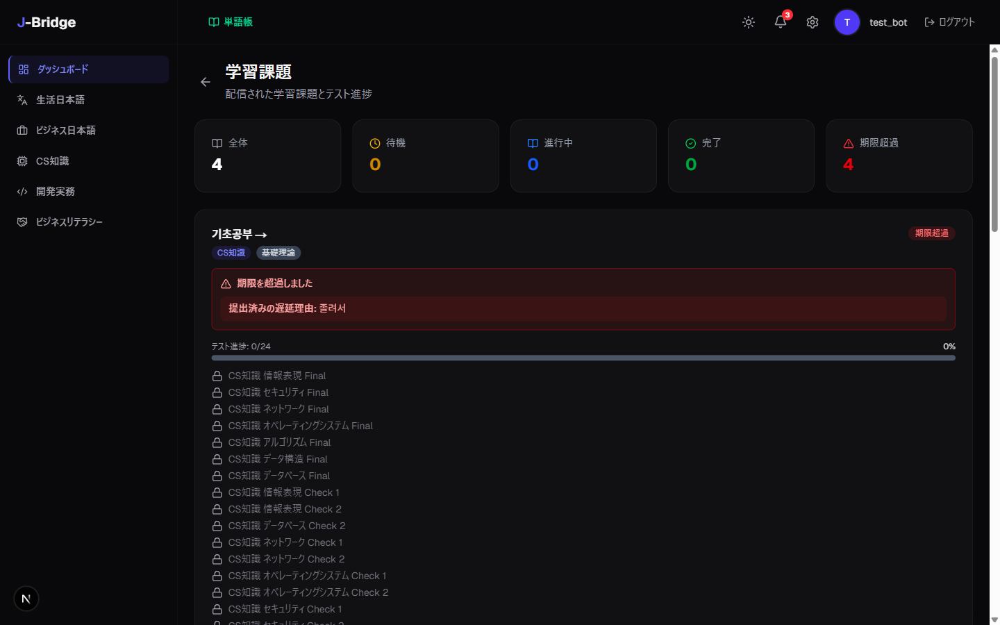

1. 관리자/멘토가 배정한 학습과제 목록이 표시됩니다
2. 과제 상태를 확인합니다:
   - **未着手 (미착수)** — 아직 시작하지 않은 과제
   - **進行中 (진행 중)** — 진행 중인 과제
   - **完了 (완료)** — 완료된 과제
   - **期限切れ (기한 초과)** — 기한이 지난 과제
3. 과제를 클릭하여 상세 내용을 확인하고 진행합니다

---

## 20. 시험 이력

**페이지:** `/dashboard/history`

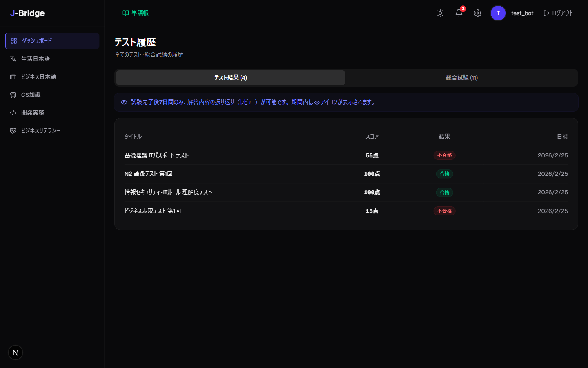

1. 과거 종합시험 및 퀴즈 응시 이력이 표시됩니다
2. 시험을 클릭하면 상세 리뷰 화면으로 이동합니다

3. 각 문제의 정답/오답, 본인의 선택, 해설을 확인합니다

---

## 21. 개인단어장

**페이지:** `/personal-vocab`

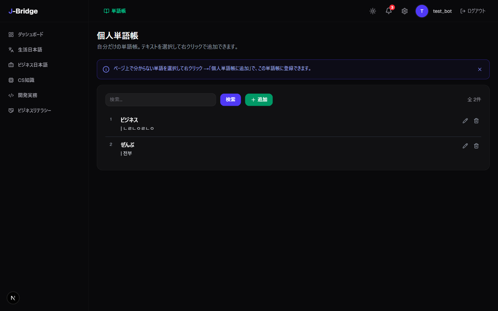

1. 「追加」 버튼으로 새로운 단어를 등록합니다
2. 단어/읽기/의미를 입력하고 저장합니다
3. 등록된 단어 목록을 검색/관리합니다
