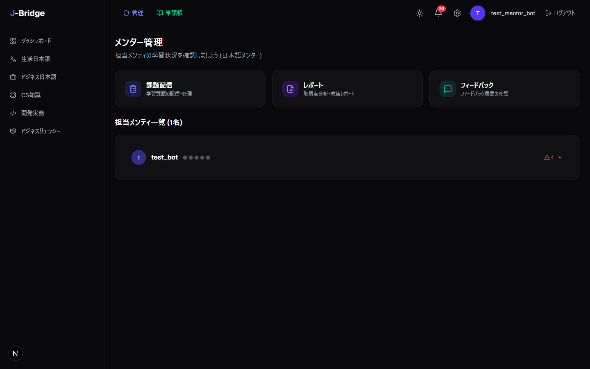
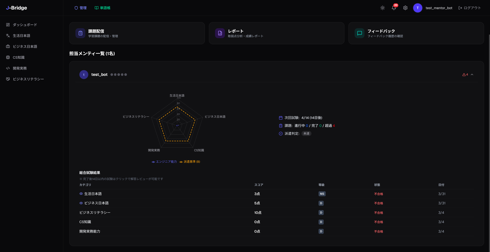
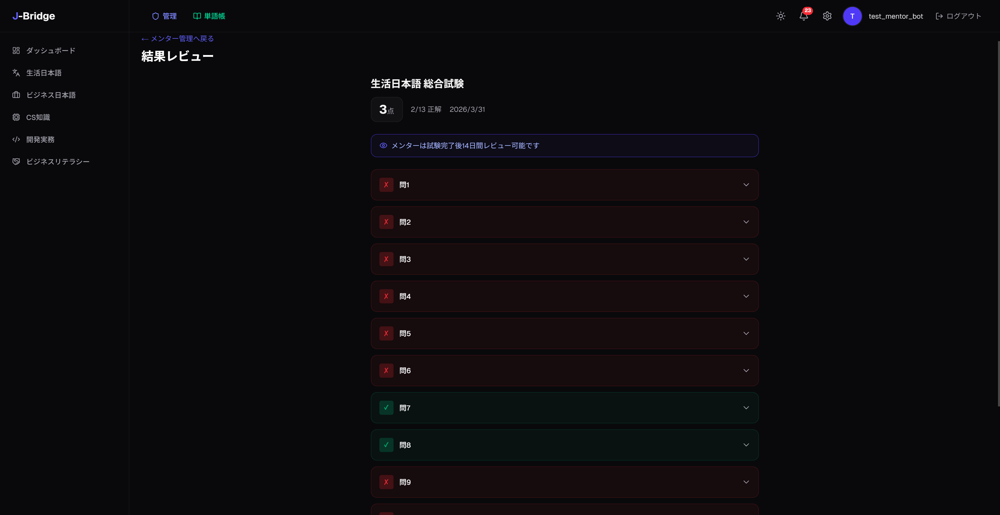
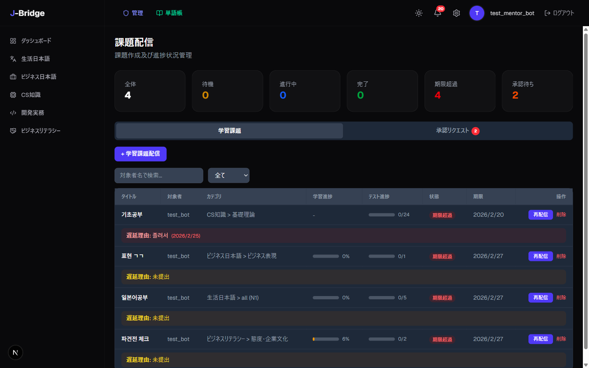
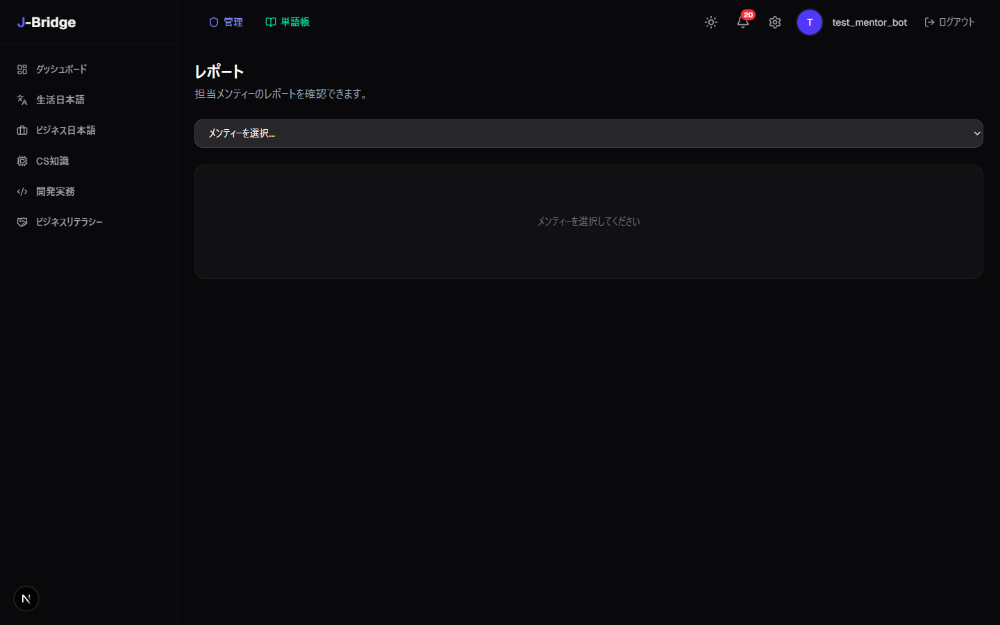
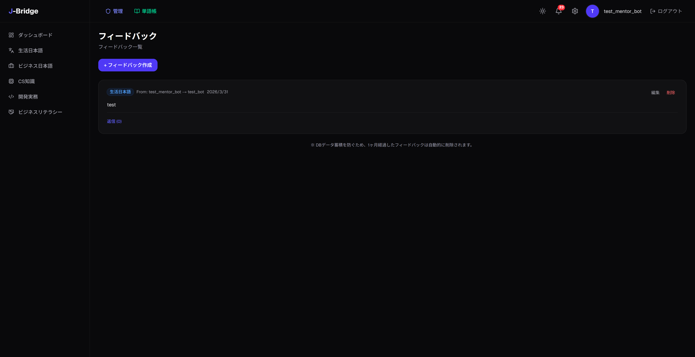

# J-Bridge 멘토 매뉴얼

> 본 매뉴얼은 J-Bridge LMS를 사용하는 멘토(지도자)를 위한 안내서입니다.
> 멘토는 학습 기능(멘티와 동일)에 더해 멘티 관리 기능을 사용할 수 있습니다.

---

## 목차

1. [멘토 대시보드](#1-멘토-대시보드)
2. [멘티 시험 리뷰](#2-멘티-시험-리뷰)
3. [과제 관리](#3-과제-관리)
4. [리포트 확인](#4-리포트-확인)
5. [피드백 작성](#5-피드백-작성)
6. [공유단어장 관리 (일본어 멘토)](#6-공유단어장-관리-일본어-멘토)

> **학습 기능 안내:** 멘토도 멘티와 동일하게 모든 학습 콘텐츠와 시험을 이용할 수 있습니다.
> 학습 기능은 [멘티 매뉴얼](mentee-manual.md)을 참조해 주세요.

---

## 1. 멘토 대시보드

**페이지:** `/mentor`

멘토 대시보드에서 확인할 수 있는 정보:

| 영역 | 설명 |
|------|------|
| **担当メンティー一覧** | 담당 멘티 목록 (이름, 현재 점수, 최근 활동) |
| **レビュー待ち** | 리뷰 대기 중인 항목 수 |

1. 관리 대시보드에서 「メンター管理」를 클릭합니다
2. 담당 멘티 목록을 확인합니다
3. 멘티 이름을 클릭하면 해당 멘티의 상세 정보를 볼 수 있습니다

---

## 2. 멘티 시험 리뷰

**페이지:** `/mentor/review/[examId]`

> *이 화면은 멘티가 시험을 완료한 후 리뷰 시 표시됩니다.*

1. 멘토 대시보드 또는 과제 관리에서 리뷰할 시험을 선택합니다 (눈 모양이 있을 경우에만 열람 가능)
2. 멘티의 답안과 정답을 비교하며 확인합니다
3. 각 문제별 정답/오답 상태와 해설을 열람합니다

> **참고:** 시험 완료 후 **14일 이내**에만 리뷰가 가능합니다.

---

## 3. 과제 관리

**페이지:** `/admin/tasks`

### 학습과제 배정

1. 관리 대시보드에서 「タスク管理」를 클릭합니다
2. 「学習課題」 탭을 선택합니다
3. 담당 멘티에게 배정된 과제 목록을 확인합니다
4. 과제의 진행 상태를 모니터링합니다

### 재시험 요청 처리

1. 「再試験リクエスト」 탭을 선택합니다
2. 멘티가 요청한 재시험 목록이 표시됩니다
3. 요청을 검토한 후 「承認」 또는 「却下」를 클릭합니다

---

## 4. 리포트 확인

**페이지:** `/admin/reports`

1. 관리 대시보드에서 「レポート」를 클릭합니다
2. 담당 멘티를 선택합니다 (멘토는 담당 멘티만 조회 가능)
3. 멘티의 성적 추이와 카테고리별 오답률을 확인합니다
4. 「AIプロンプトをコピー」 버튼으로 성적 데이터를 AI 분석용 프롬프트로 복사할 수 있습니다
5. ChatGPT 등 AI 채팅에 붙여넣으면 지도 방법을 제안받을 수 있습니다

---

## 5. 피드백 작성

1. 리포트 화면에서 피드백을 작성합니다
2. 피드백 내용을 입력합니다
3. 「送信」을 클릭하여 멘티에게 전달합니다
4. 기존 피드백은 수정/삭제가 가능합니다

